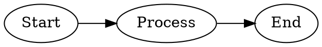
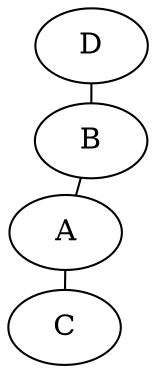

# Graphviz Layout Engines Guide

Choosing the right engine is 80% of the battle for a readable diagram.
Use `layout=engine` internally or specify `engine` in your tool.

## 1. `dot` (Hierarchical)
**Best for**: Flowcharts, Decision Trees, State Machines, Dependency Trees.
- Default engine.
- Arranges nodes in ranks (Top-to-Bottom by default).
- Key Attributes: `rankdir=TB/LR/BT/RL`, `ranksep`.

## 2. `neato` (Force-Directed / Spring Model)
**Best for**: Networks, Social Graphs, Mindmaps (unrooted), Entity Relationship.
- Uses spring forces to push nodes apart.
- Nodes tend to cluster naturally.
- Key Attributes: `overlay="false"`, `splines=true` (curved), `model=subset`.

## 3. `fdp` (Force-Directed Placement)
**Best for**: Similar to `neato`, but handles larger graphs and clusters better.
- If you have many disconnected components, try `fdp`.

## 4. `twopi` (Radial)
**Best for**: Hierarchies radiating from a central root.
- E.g. Network topology around a core router.
- Key Attributes: `root=NodeID`.

## 5. `circo` (Circular)
**Best for**: Cyclic dependencies, ring networks.
- Places nodes in a circle.
- Good for small, interconnected sets.

## Summary Table

| Use Case | Engine | Key Props |
| :--- | :--- | :--- |
| **Workflow** | `dot` | `rankdir=LR` |
| **Architecture** | `dot` | `compound=true` |
| **Network** | `neato` | `overlap=scalexy` |
| **Mindmap** | `twopi` | `root=Center` |
