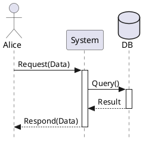
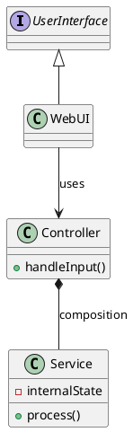
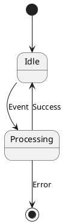
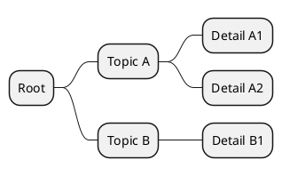

# PlantUML Syntax Cheat Sheet

This document serves as a reference for generating correct PlantUML code.

## 1. Sequence Diagrams

**Use**: Interactions between components.



## 2. Class Diagrams

**Use**: Static structure.



## 3. Component Diagrams (C4 Level 2)

**Use**: Architecture overview.

```plantuml
@startuml
!include https://raw.githubusercontent.com/plantuml-stdlib/C4-PlantUML/master/C4_Container.puml

Person(user, "User")
System_Boundary(c1, "System Context") {
    Container(app, "Web App", "React", "Frontend")
    ContainerDb(db, "Database", "PostgreSQL", "Stores user data")
}

Rel(user, app, "Uses", "HTTPS")
Rel(app, db, "Reads/Writes", "SQL")
@enduml
```

## 4. State Diagrams

**Use**: Lifecycle or workflow visualization.



## 5. MindMap

**Use**: Brainstorming or hierarchical data.



## 6. Layout Hints (Hidden Edges)

Use `-[hidden]-` or `-[hidden]up-`, `-[hidden]down-` to force relative positioning without drawing a line.

```plantuml
ClassA -[hidden]-> ClassB : forces B below A
ClassC -[hidden]left-> ClassD : forces D left of C
```
